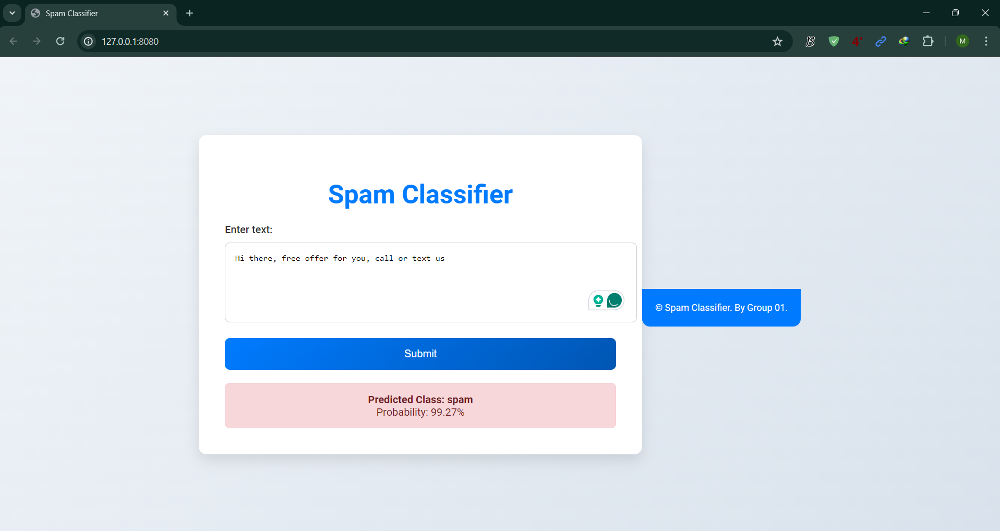

# Spam Classifier

A web-based application that classifies text as "spam" or "ham" using a pre-trained LSTM model. This project is built with Flask for the backend and a TensorFlow/Keras LSTM model for text classification. The frontend is designed to provide a modern, user-friendly interface for entering text and viewing classification results.

## Features

- Classify input text as "spam" or "ham" with a probability score.
- Simple and intuitive user interface.
- Real-time classification using a pre-trained LSTM model.
- Responsive design for various screen sizes.

## Installation

1. **Clone the repository:**

   ```bash
   git clone https://github.com/mnhemal/spam-classifier.git
   cd spam-classifier
   ```

2. **Create and activate a virtual environment:**

   ```bash
   python -m venv venv
   source venv/bin/activate  # On Windows use `venv\Scripts\activate`
   ```

3. **Install the required packages:**

   ```bash
   pip install -r requirements.txt
   ```

4. **Download the pre-trained model and tokenizer:**

   Ensure you have the following files in the project directory:

   - `spam_classifier_model.h5`
   - `tokenizer.pickle`

5. **Run the application:**

   ```bash
   python app.py
   ```

6. **Open your browser and go to:**

   ```
   http://127.0.0.1:8080/
   ```

## Usage

1. Enter the text you want to classify in the provided text area.
2. Click the "Submit" button.
3. View the classification result and the probability score displayed below the form.

## Project Structure

- `app.py`: The main Flask application file.
- `templates/`: Directory containing HTML templates.
  - `index.html`: The main page template.
- `static/`: Directory for static files (CSS, JS, images, etc.).
- `requirements.txt`: A file listing the required Python packages.
- `spam_classifier_model.h5`: The pre-trained LSTM model.
- `tokenizer.pickle`: The tokenizer used for text preprocessing.

## Model Training

The LSTM model was trained on a dataset of spam and ham messages. For details on the training process and dataset, please refer to the `model_training` directory (if included) or the accompanying documentation.

## Contributing

Contributions are welcome! Please feel free to submit a Pull Request.

## License

This project is licensed under the MIT License. See the `LICENSE` file for more details.

## Acknowledgments

- [TensorFlow](https://www.tensorflow.org/)
- [Keras](https://keras.io/)
- [Flask](https://flask.palletsprojects.com/)

## Contact

For any inquiries, please contact [1801007@iot.bdu.ac.bd](mailto:1801007@iot.bdu.ac.bd).

---

### Screenshots


_Screenshot of the home page with the text input form._


_Screenshot showing the classification result._
